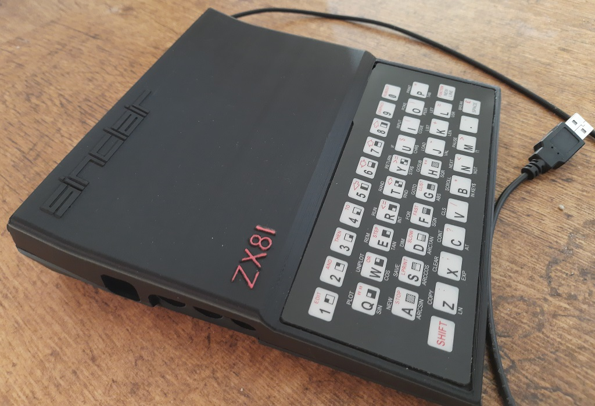
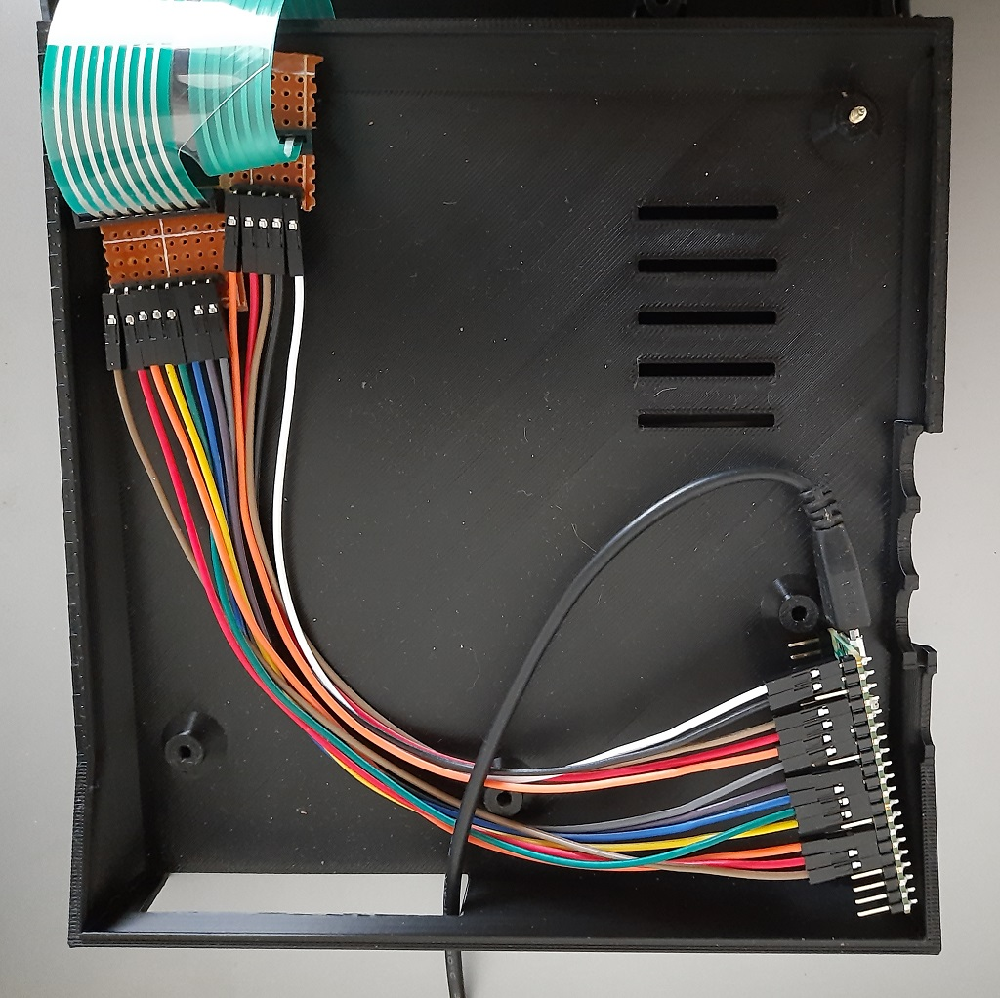

# ZX81_USB_KBD
This CircuitPython code for the Raspberry Pi Pico 2040 allows a [Sinclair ZX81](https://en.wikipedia.org/wiki/Sinclair_ZX81) keyboard matrix to be used as the basis for a USB keyboard that can be used in Linux, MS Windows or for [picozx81](https://github.com/ikjordan/picozx81).

**A new keyboard matrix and a 3d print of the ZX81 case was used, so no ZX81 were harmed in the production of this project**

# Resources
The following resources are needed to complete this project
## ZX81 Case
A 3d printed replica ZX81 case, using [this](https://www.thingiverse.com/thing:4525078) design
## ZX81 Keyboard membrane
Replacement ZX81 keyboard membranes are readily available from sites such as ebay or [Sell My Retro](https://www.sellmyretro.com/category/retro-computers/sinclair/sinclair-zx81/components)
## ZX81 Keyboard connectors
The ZX81 keyboard membrane connects through one 5 way and one 8 way connector. These can be purchased from Sell My Retro or ebay
## Raspberry Pi Pico
To minimise soldering, a Pi Pico H with male headers attached can be used

## Screws, Rubber feet, USB cable
Five 2.5x12 or 2.5x14 screws are needed to join the bottom and top halves of the case. To finish the effect, ZX81 replacement rubber feet to cover the screws can be found on ebay or Sell My Retro

A micro to USB A cable makes the connection between the Pico and the Windows or Linux host. The Pico is powered by the host computer
# Connecting the keyboard membrane
The 13 lines from the membrane (5 columns, 8 rows) are routed to the first 13 GPIO lines on a Raspberry Pico via the keyboard connectors. The 5 columns connect to GP0 through to GP4, The rows connect to GP5 to GP12. This can be simply achieved by mounting the keyboard connectors on Veroboard. PCB headers are then attached to the Veroboard and Dupont female connectors used to join the header pins to the Pico GPIO pins. I am sure those with more hardware skills than me could easily fabricate a dedicated PCB, including mounting the Pico 2040

No diodes are used in the circuit. The keyboard functions well without them
# Software Installation
The project uses CircuitPython, and the Adafruit Matrix Keypad library. Instructions for installation can be found [here](https://learn.adafruit.com/matrix-keypad/python-circuitpython).

The Adafruit Matrix Keypad library depends on the Adafruit HID Library. Instructions for installation of this library can be found [here](https://learn.adafruit.com/pico-four-key-macropad/installing-libraries).

The code must run automatically on power up. In addition the usual auto-mount of the CIRCUITPY drive should be disabled.

`boot.py` is used to prevent automount. Using `code.py` as the filename for the code file ensures that the code will run on power on (see [here](https://learn.adafruit.com/customizing-usb-devices-in-circuitpython/circuitpy-midi-serial))

Both `boot.py` and `code.py` should be copied to the root directory of the CIRCUITPY drive

# Trouble shooting
## Directory Structure
After successful installation of the libraries and python files, the directory structure on the Pico should look as follows:

    root
    ├── lib
    │   ├── adafruit_hid
    │   │   ├── consumer_control.mpy
    │   │   ├── consumer_control_code.mpy
    │   │   ├── keyboard.mpy
    │   │   ├── keyboard_layout_base.mpy
    │   │   ├── keyboard_layout_us.mpy
    │   │   ├── keycode.mpy
    │   │   ├── mouse.mpy
    │   │   └── __init__.mpy
    │   └── adafruit_matrixkeypad.mpy
    ├── boot.py
    └── code.py

## Connections
An image of colour coded connections

## Uploading new versions
After placing `boot.py` into the root directory, it is not possible to save new files onto the Pico flash.
Perform the following if you later wish to update files on the Pico:
1. Connect to Thonny and stop program execution by pressing the red square
2. Enter the following into the shell:  
`import storage`  
`storage.remount("/", readonly=False)`
3. You will now be able to save updates back to the Pico

**Note:** The steps described above may not be supported by later versions of CircuitPython.
As a last resort, it is always possible to clear the flash using [nuke](https://github.com/raspberrypi/pico-examples/tree/master/flash/nuke) from the Pico SDK.
Then reinstall CircuitPython and the project files as described [above](#directory-structure)

# Optional Generation of Function key presses
The ZX81 keyboard only has 40 keys, so the number of different key presses that can be made are much lower than for a more modern keyboard.
[picozx81](https://github.com/ikjordan/picozx81) can detect the key sequence [shift] release [shift] release [number] and convert the result to a function key press.

Other ZX81 emulators (such as [sz81 v2.3.12](https://github.com/SegHaxx/sz81) or [extended sz81 v2.1.8](https://github.com/ikjordan/sz81_2_1_8)) also require function key presses, but do not perform
the "double shift" translation. This project includes an alternative `code_function.py` which detects and translates
[shift] [shift] 1 to 9 to keypress F1  to F9. It also converts [shift] [shift] 0 to the Escape key.

If it is desired to use this keyboard with sz81 then overwrite `code.py` on the Pico with [`code_function.py`](code_function.py)
i.e. rename the [`code_function.py`](code_function.py) in this rep to `code.py` and overwrite the original `code.py`
on the Pico.

# Notes
## Emulators
Several ZX81 emulators have been tested. Most decode shift period as a comma. However at least two emulators do not, with shift period generating greater than

To support all emulators the shift state is tracked and a comma key state is explicitly sent in place of shift period

[picozx81](https://github.com/ikjordan/picozx81) is designed so that it can be completely controlled by this keyboard using `code.py`. Other emulators may require `code_function.py` to generate [function key presses](#optional-generation-of-function-key-presses) 

## Colouring the case
The ZX81 logo on the case is coloured Red. An Edding 780 Red (002) marker can be used to achieve this

# Why?
The ZX81 keyboard is not the greatest for fast typing. Also it only possesses a sub-set of the keys needed to drive a modern OS. The reasons for creating this project were:
1) It can be fun to control a ZX81 emulator with an authentic keyboard
2) It makes a change for me to code for a real time application in Python, rather than C
3) As a realistic fully functioning keyboard for picozx81

It is also amusing that a $3 dollar part, running at 125MHz, with 264kB of RAM and 2MB of Flash, is being used to control the keyboard of the ZX81, when originally the ZX81 processor ran at 3.25MHz, and the base ZX81 was initially sold with 1kB of RAM!
